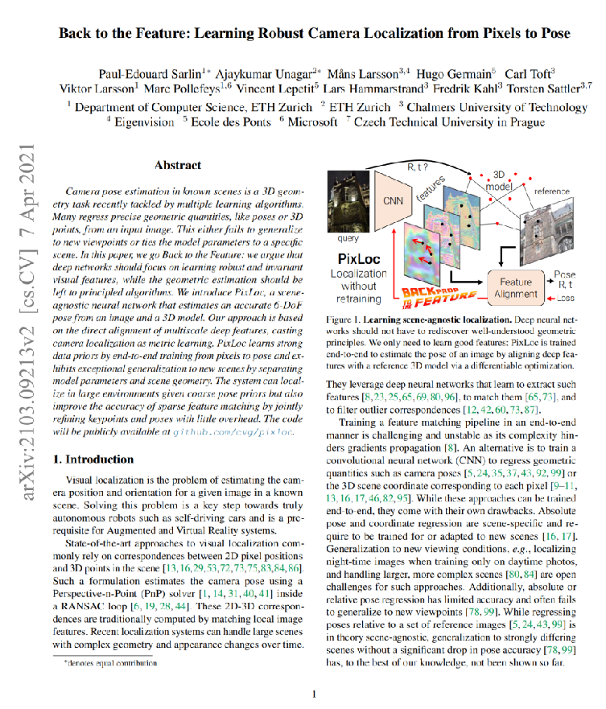

# 计算机前沿技术

肖涛 2310543002

复现论文：[Back to the Feature: Learning Robust Camera Localization from Pixels to Pose](https://arxiv.org/abs/2103.09213)

源码开源：https://github.com/cvg/pixloc

<p align="center">
  </a>
</p>


### 安装环境
具体配置要求可以参考`requirements.txt`

除了基本的配置要求外，还需要配置好jupyter和colmap。版本最新即可。

### Demo

复现工作在[`demo.ipynb`](./notebooks/demo.ipynb)中，该demo实现了论文提到的pixloc算法，包括输入数据、进行CNN预测并可视化、计算最终位姿、分析损失函数以及输出二维和三维的演示视频。在源代码的基础上，我添加了一个获取三维重建模型ply文件的功能，该功能可以将输入的数据集提取出相应的三维重建模型，包括稀疏重建模型和稠密重建模型，并以ply文件的格式输出，这些文件可以在相关软件(cloudcompare)中进行可视化的操作。
使用作者提供的Cambridge/ShopFacade数据集，数据集可以通过命令行下载：

```bash
python -m pixloc.download --select Cambridge
```
或者到相应网站下载：https://www.repository.cam.ac.uk/bitstream/handle/1810/251336/ShopFacade.zip.


### 三维演示

三维演示在运行demo之后可以运行`python3 viewer/server.py` 并打开链接：http://localhost:8192/viewer/viewer.html